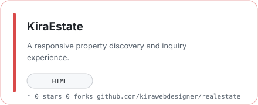
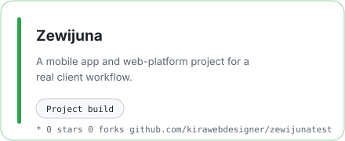
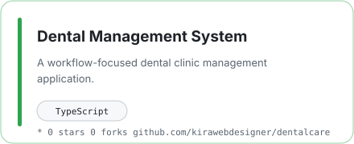
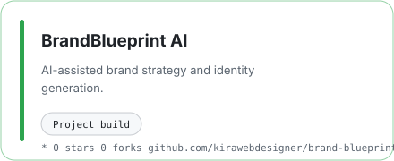

# Kirubel

### Student developer · Product builder · AI systems explorer

**Web products · mobile apps · useful AI**

[GitHub](https://github.com/kirawebdesigner) · [All repositories](https://github.com/kirawebdesigner?tab=repositories)

## What I build

I’m **Kirubel**, a student developer and product builder. I turn rough ideas into web apps, mobile products, and AI-powered tools. I’m currently focused on stronger architecture, better APIs, thoughtful interfaces, and practical automation.

## Toolbox

  

## Builder radar

  <picture>
    <source media="(prefers-color-scheme: dark)" srcset="assets/radar-dark.svg">
    <source media="(prefers-color-scheme: light)" srcset="assets/radar-light.svg">
    
  </picture>

  <picture>
    <source media="(prefers-color-scheme: dark)" srcset="assets/language-radar-dark.svg">
    <source media="(prefers-color-scheme: light)" srcset="assets/language-radar-light.svg">
    
  </picture>

The first radar is self-rated. The second reflects language bytes across my public, non-fork repositories. Both are snapshots, not certifications.

## Featured builds

  <a href="https://github.com/kirawebdesigner/realestate">
    <picture>
      <source media="(prefers-color-scheme: dark)" srcset="assets/card-realestate-dark.svg">
      <source media="(prefers-color-scheme: light)" srcset="assets/card-realestate-light.svg">
      
    </picture>
  </a>

  <a href="https://github.com/kirawebdesigner/zewijunatest">
    <picture>
      <source media="(prefers-color-scheme: dark)" srcset="assets/card-zewijunatest-dark.svg">
      <source media="(prefers-color-scheme: light)" srcset="assets/card-zewijunatest-light.svg">
      
    </picture>
  </a>

  <a href="https://github.com/kirawebdesigner/dentalcare">
    <picture>
      <source media="(prefers-color-scheme: dark)" srcset="assets/card-dentalcare-dark.svg">
      <source media="(prefers-color-scheme: light)" srcset="assets/card-dentalcare-light.svg">
      
    </picture>
  </a>

  <a href="https://github.com/kirawebdesigner/brand-blueprint-generator">
    <picture>
      <source media="(prefers-color-scheme: dark)" srcset="assets/card-brand-blueprint-generator-dark.svg">
      <source media="(prefers-color-scheme: light)" srcset="assets/card-brand-blueprint-generator-light.svg">
      
    </picture>
  </a>

- **Kira Real Estate** — [realestate](https://github.com/kirawebdesigner/realestate): a practical real-estate web experience.
- **Zewijuna** — [zewijunatest](https://github.com/kirawebdesigner/zewijunatest): a mobile app and web-platform project.
- **Dental Management System** — [dentalcare](https://github.com/kirawebdesigner/dentalcare): a workflow-focused dental clinic management application.
- **BrandBlueprint AI** — [brand-blueprint-generator](https://github.com/kirawebdesigner/brand-blueprint-generator): AI-assisted brand strategy and identity generation.

## GitHub activity

  <picture>
    <source media="(prefers-color-scheme: dark)" srcset="assets/github-stats-dark.svg">
    <source media="(prefers-color-scheme: light)" srcset="assets/github-stats-light.svg">
    
  </picture>

  <picture>
    <source media="(prefers-color-scheme: dark)" srcset="assets/activity-dark.svg">
    <source media="(prefers-color-scheme: light)" srcset="assets/activity-light.svg">
    
  </picture>

Generated from public GitHub data and refreshed in this repository on a schedule.

---

Designed around the work, not the widget collection.

