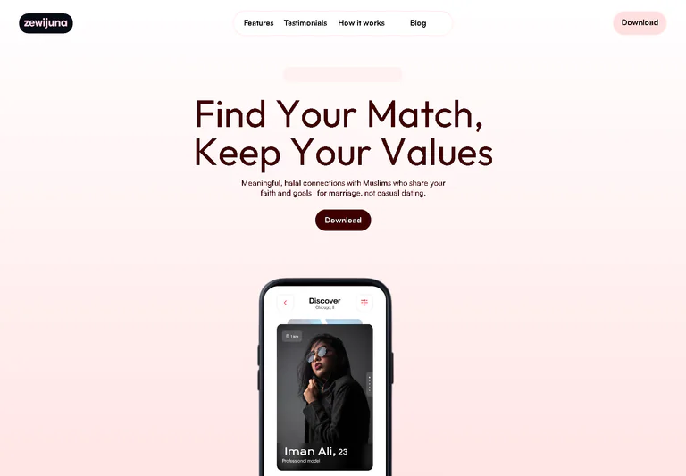
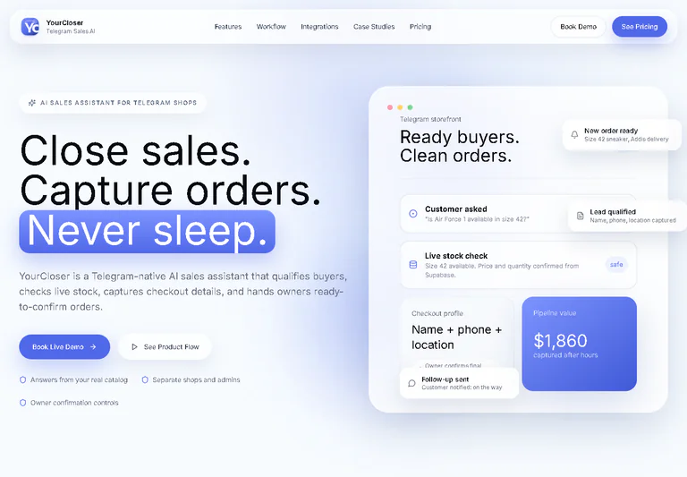
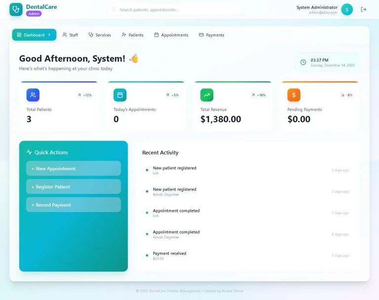
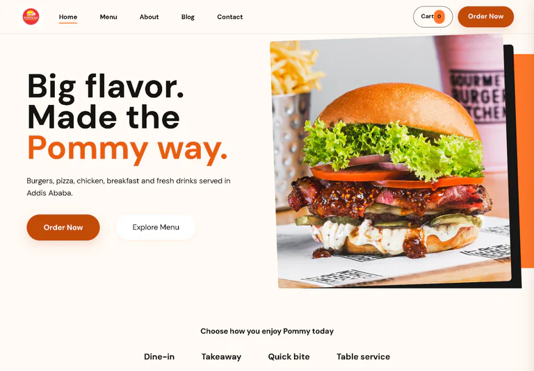

# Kirubel

### Full-stack product builder · Digital systems developer

**Web products · mobile apps · SaaS · automation**

[Portfolio](https://kiraweb.pro.et) · [GitHub](https://github.com/kirawebdesigner) · [LinkedIn](https://www.linkedin.com/in/kirubel-daniel/)

## What I build

I’m **Kirubel Daniel**, a full-stack product builder based in Addis Ababa, Ethiopia. I build real digital products across frontend, backend, databases, automation, deployment, and the operational details that make software useful beyond the screen.

My work spans mobile applications, SaaS platforms, commerce systems, internal management tools, and responsive product experiences. I care about clear workflows, role-aware systems, reliable data, and interfaces that help people move from a problem to a practical next step.

## Toolbox

  

## Builder radar

  <picture>
    <source media="(prefers-color-scheme: dark)" srcset="assets/radar-dark.svg">
    <source media="(prefers-color-scheme: light)" srcset="assets/radar-light.svg">
    
  </picture>

  <picture>
    <source media="(prefers-color-scheme: dark)" srcset="assets/language-radar-dark.svg">
    <source media="(prefers-color-scheme: light)" srcset="assets/language-radar-light.svg">
    
  </picture>

The first radar is self-rated. The second reflects language bytes across my public, non-fork repositories. Both are snapshots, not certifications.

## Featured projects

These are selected directly from my portfolio. Each visual is self-hosted, and every project has a clear route to its live experience or case study.

### [Zewijuna](https://zewijuna.com)

**Mobile + web matchmaking product.** A connected product with onboarding, profile discovery, preference filters, realtime communication, membership flows, and verification. [Live product](https://zewijuna.com) · [Case study](https://kiraweb.pro.et/work/zewijuna/) · [GitHub](https://github.com/kirawebdesigner/zewijunatest)

### [YourCloser](https://yourcloser.web.app)

**Telegram commerce automation SaaS.** A multi-tenant commerce system for product browsing, stock checks, checkout, order decisions, broadcasts, subscriptions, and operational control. [Live product](https://yourcloser.web.app) · [Case study](https://kiraweb.pro.et/work/yourcloser/)

### [DMS](https://github.com/kirawebdesigner/dentalcare)

**Dental operations management system.** Role-based workflows for administrators, reception, doctors, and finance across patients, appointments, treatments, billing, staff, reporting, and notifications. [GitHub](https://github.com/kirawebdesigner/dentalcare) · [Case study](https://kiraweb.pro.et/work/dms/)

### [Pommy](https://pommydemo.netlify.app)

**Restaurant commerce website.** A searchable menu, product discovery, cart, checkout, delivery and takeaway information, order handling, and protected staff operations for a local restaurant experience. [Live product](https://pommydemo.netlify.app) · [Case study](https://kiraweb.pro.et/work/pommy/)

## More work from the portfolio

- **[KiraEstate](https://kiraweb.pro.et/work/kiraestate/)** — a responsive property discovery and inquiry experience designed around Addis Ababa real estate. [Live concept](https://kiraestate.netlify.app/) · [GitHub](https://github.com/kirawebdesigner/realestate)
- **[Majestic](https://kiraweb.pro.et/work/majestic/)** — a premium corporate website concept that turns a broad service offering into one confident presentation. [Live concept](https://majestictradingplc.netlify.app)

## Open-source tooling

### [KirzKit](https://github.com/kirawebdesigner/KirzKit)

A portable operating layer for AI coding agents, with specialist workflows, reusable skills, project context, and validation-first guardrails. [View repository](https://github.com/kirawebdesigner/KirzKit)

## GitHub activity

  <picture>
    <source media="(prefers-color-scheme: dark)" srcset="assets/github-stats-dark.svg">
    <source media="(prefers-color-scheme: light)" srcset="assets/github-stats-light.svg">
    
  </picture>

  <picture>
    <source media="(prefers-color-scheme: dark)" srcset="assets/activity-dark.svg">
    <source media="(prefers-color-scheme: light)" srcset="assets/activity-light.svg">
    
  </picture>

Generated from public GitHub data and refreshed in this repository on a schedule.

---

Building products, systems, and digital tools that work beyond the screen.

