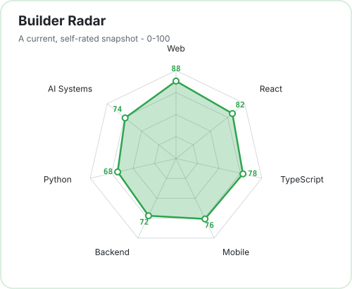
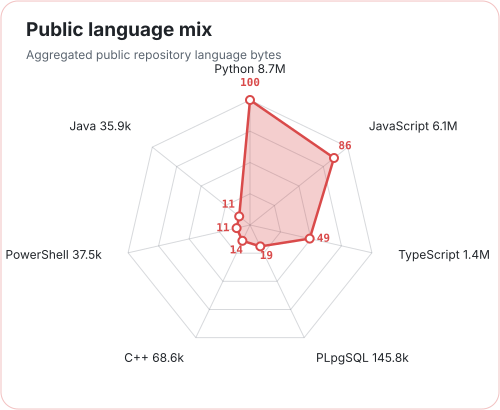
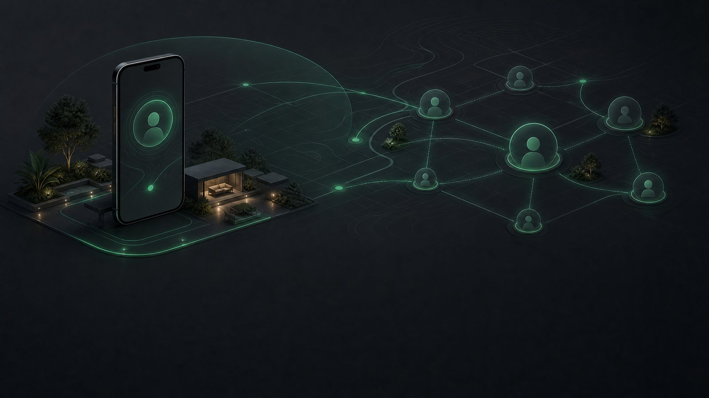
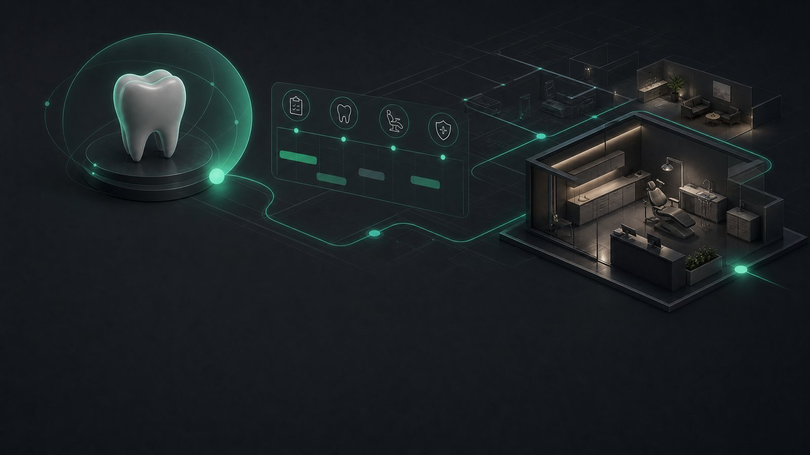
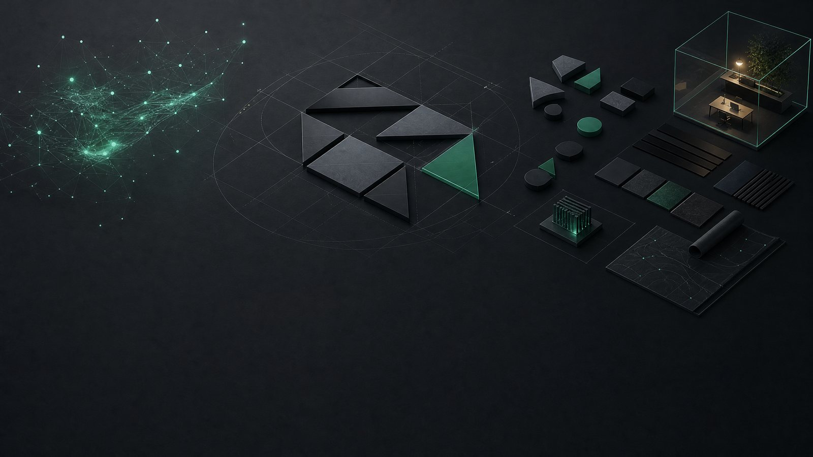
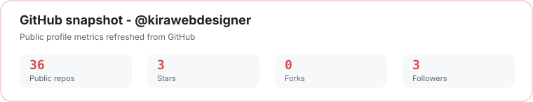
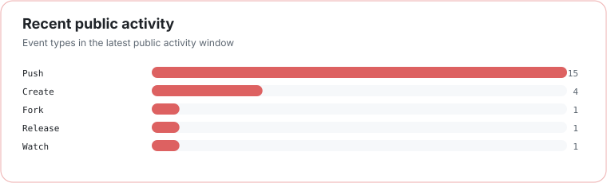

# Kirubel

### Student developer · Product builder · AI systems explorer

**Web products · mobile apps · useful AI**

[GitHub](https://github.com/kirawebdesigner) · [All repositories](https://github.com/kirawebdesigner?tab=repositories)

## What I build

I’m **Kirubel**, a student developer and product builder. I turn rough ideas into web apps, mobile products, and AI-powered tools. I’m currently focused on stronger architecture, better APIs, thoughtful interfaces, and practical automation.

## Toolbox

  

## Builder radar

  <picture>
    <source media="(prefers-color-scheme: dark)" srcset="assets/radar-dark.svg">
    <source media="(prefers-color-scheme: light)" srcset="assets/radar-light.svg">
    
  </picture>

  <picture>
    <source media="(prefers-color-scheme: dark)" srcset="assets/language-radar-dark.svg">
    <source media="(prefers-color-scheme: light)" srcset="assets/language-radar-light.svg">
    
  </picture>

The first radar is self-rated. The second reflects language bytes across my public, non-fork repositories. Both are snapshots, not certifications.

## Featured projects

A focused selection of products and systems I’ve been building. **Each banner links directly to its repository.**

### [Kira Real Estate](https://github.com/kirawebdesigner/realestate)

**A practical real-estate web experience** with a product-focused interface and property discovery at its center. [View repository →](https://github.com/kirawebdesigner/realestate)

### [Zewijuna](https://github.com/kirawebdesigner/zewijunatest)

**A mobile app and web-platform project** built around a connected, human-centered workflow. [View repository →](https://github.com/kirawebdesigner/zewijunatest)

### [Dental Management System](https://github.com/kirawebdesigner/dentalcare)

**A workflow-focused dental clinic application** designed to bring appointments, care, and operations into one clearer system. [View repository →](https://github.com/kirawebdesigner/dentalcare)

### [BrandBlueprint AI](https://github.com/kirawebdesigner/brand-blueprint-generator)

**An AI-assisted brand strategy workspace** for turning early direction into a more structured identity system. [View repository →](https://github.com/kirawebdesigner/brand-blueprint-generator)

## GitHub activity

  <picture>
    <source media="(prefers-color-scheme: dark)" srcset="assets/github-stats-dark.svg">
    <source media="(prefers-color-scheme: light)" srcset="assets/github-stats-light.svg">
    
  </picture>

  <picture>
    <source media="(prefers-color-scheme: dark)" srcset="assets/activity-dark.svg">
    <source media="(prefers-color-scheme: light)" srcset="assets/activity-light.svg">
    
  </picture>

Generated from public GitHub data and refreshed in this repository on a schedule.

---

Designed around the work, not the widget collection.

